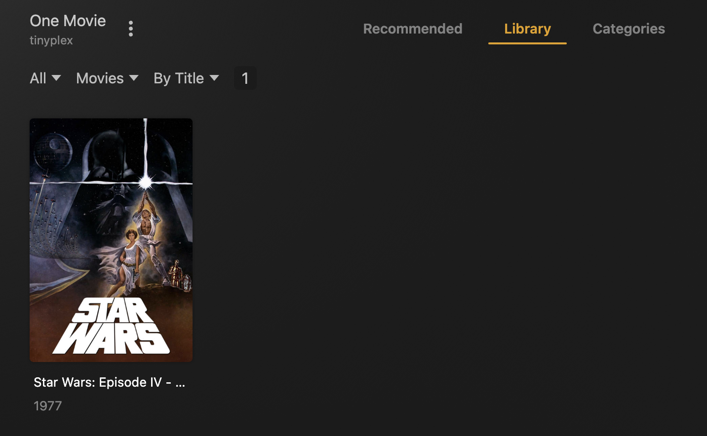

## introduction

This repo sets out a framework and files to test Plex-Meta-Manager overlay behavior.

## setup

Create a new library in Plex.  Call the library "One Movie".  Add one movie to it, "Star Wars (1977)".

An easy way to do add the one movie is to create a new folder on your system and put a shortcut to the fodler containing "Star Wars" in that folder.

In linux:

```shell
> cd /mnt/local/Media
> mkdir one-movie
> cd one-movie/
> ln -s /mnt/unionfs/movies/70s/'Star Wars (1977) {imdb-tt0076759} {tmdb-11}'/ .
> ls
'Star Wars (1977) {imdb-tt0076759} {tmdb-11}'
```

Then add `/mnt/local/Media/one-movie` to that new Plex library.

Scan the library.  You shoudl end up with something like this:

